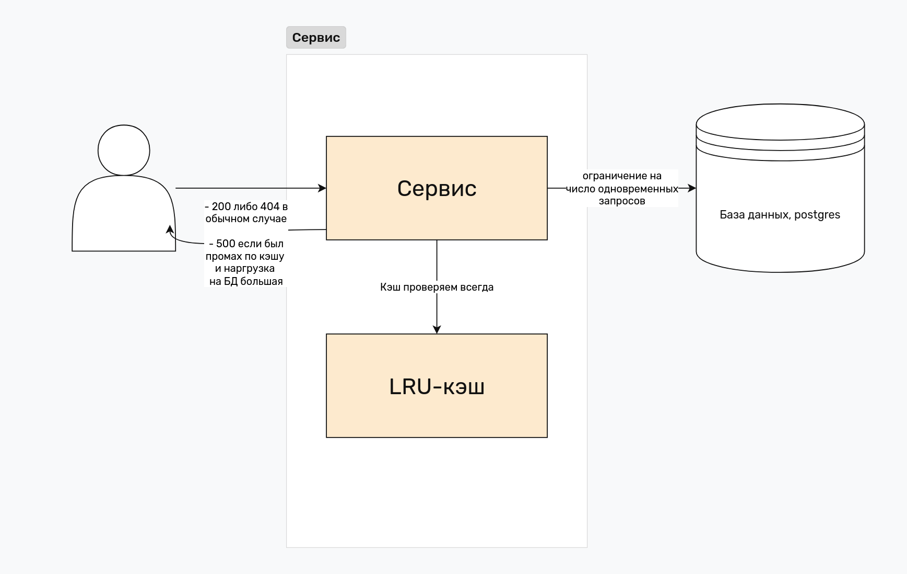

# Решение задачи "справиться с амплификацией нагрузки на БД для look-aside кэша"

**Идея**: ограничить количество одновременных запросов к БД с помощью семафора (в случае Go -- канала).
Все запросы к БД занесены в критические секции семафора, что позволяет не увеличивать нагрузку на нее даже в случае уменьшения cache hit-а.

Предусмотрены неуспешные ответы на запросы пользователей в случае превышения лимита одновременных запросов к БД (graceful-деградация). Это делается с помощью неблокующей записи в канал. Убедиться в этом можно установив `maxConcurrentDBQueries=1` и выполнив много запросов к серверу одновременно (например, из файла [high_load_requests.sh](high_load_requests.sh)). В БД вставится не 600 строк, а меньше, на невставленные будет возвращен код ответа 500.

Например, всего на сервис идёт 1000 rps, из них 900 попадают в кэш, а 100 промахиваются и идут в БД. Тогда в случае перезагрузки сервера общее кол-во запросов, допустим останется таким же, но кэш станет пустым и пока он не наполнится, нагрузка на БД резко возрастет. Однако если мы всё же установим максимальное кол-во одновременных запросов к БД, например в 200, то только 200 из 1000 запросов будут обрабатываться, на остальные будут сразу же возвращаться ответы 500. Это хорошо тем, что сервис не падает, на семафоре не скапливается очередь запросов, но в том же время часть клиентских запросов обрабатывается и они видят, что сервис хоть как-то работает.

Схема системы:


Как поднять БД:
```
sudo -u postgres psql
CREATE DATABASE db1;
CREATE USER dmitry WITH PASSWORD 'pwd';
GRANT ALL PRIVILEGES ON DATABASE db1 TO dmitry;
GRANT ALL ON DATABASE db1 TO dmitry;
ALTER DATABASE db1 OWNER TO dmitry;
\q
psql -U dmitry -d db1

CREATE TABLE pastes (
    short_id BIGINT NOT NULL PRIMARY KEY,
    target_link TEXT NOT NULL
);
```

Запуск сервера из директории service:
```
go run app/main.go
```

Примеры запросов на сервер:
```
curl -X POST -d "target_link=https://example.com" http://localhost:8080/write
curl -X GET "http://localhost:8080/read?short_id=1"
```
